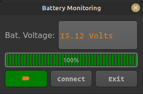

# Simple Battery Status Indicator and Control

`This small project controls the charging system of 12V Battery. The system has auto cutoff feature therefore the battery will be disconnected from the charger when it reaches the higher threshold voltage. The battery also will be connected to charger when the voltage across the battery falls below the minimum set voltage. The desktop battery level indicator is implemented using PyQt5-Python.`

- ### Battery Level Indicator UI Screenshot
